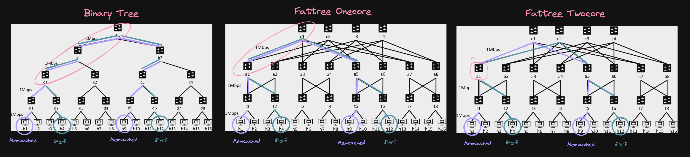
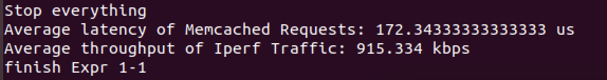
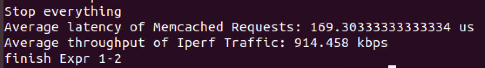
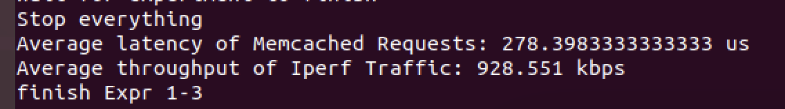

# CS 145 Project 1

## Author and collaborators

### Author name

Cory Zimmerman, cfzimmerman@college.harvard.edu

### Collaborators

Office hours and q&a section

## Answers to the questions

**Times (k = 4):**

- Onecore Fattree:
  - Memcached latency: (169.33 + 239.33 + 186.55 + 179.40 + 172.34) / 5 = 189.39 us
  - iPerf throughput: (916.52 + 914.58 + 913.93 + 916.85 + 915.33) / 5 = 915.44 kbps
- Twocore Fattree:
  - Memcached latency: (182.11 + 188.50 + 174.95 + 178.25 + 169.30) / 5 = 178.62 us
  - iPerf throughput: (911.55 + 910.98 + 913.25 + 911.52 + 914.458) / 5 = 912.35 kbps
- Binary tree:
  - Memcached latency: (239.18 + 254.55 + 191.03 + 165.18 + 278.40) / 5 = 225.67 us
  - iPerf throughput: (937.33 + 926.87 + 932.25 + 931.85 + 928.55) / 5 = 931.37 kbps

**Synthesis:**

There was a lot of noise in the data collection. I think local things like CPU scheduling made a big difference. For example, focusing on the UTM tab instead of my other terminal cut results almost in half. Closing my browser changed by another ~20 percent. Only after I closed most tabs and focused on the UTM window did I start getting moderately consistent results.

Once I figured that out, I got the less noisy results above. It seems Memcached latency is worst for the binary tree, intermediate for the onecore fattree, and best for the twocore fattree. My suspicion is that the binary tree is taller and has more total links to traverse than the other two, making it slowest. The onecore fattree is stuck routing all traffic from the left aggregator to the left core. It makes sense that the twocore fattree should be a bit faster because it's able to route from the aggregator via two links to two cores, reducing congestion on the aggregator/core link. However, I’m surprised that didn’t manifest in the iPerf results as well.

The iPerf results are reversed. In the picture below, I’ve outlined Memcached and iPerf paths in purple and green and put pink marks around clear bottlenecks. In the binary tree, the 2 mbps capacity of the hosts is stuck behind a 1 mbps link from “c” to “b”. In the onecore fattree, the 2 mbps capacity of the hosts is stuck behind a 1 mbps link from aggregator to core. In the twocore fattree, there seems to be a funnel at the aggregator level but no exact bottleneck link. So, I can’t say with confidence why the twocore throughput is lower. I’d expect it to be higher. I’ve inspected my network and even wrote some tests in the controller directory to ensure the routing logic is as-expected for twocore. I predict opening up the other cores and aggregators would present a more dominant picture of both latency and throughout for a multicore fattree.

Below are three screenshots of both Memcached and iPerf. These were the last results from the last batch of tests I ran over the course of a couple days (it took me a while to figure out the windowing thing mentioned at the top). I just saw an Ed post asking for screenshots of all runs, but these were already generated and the assignment only asks for three. Thanks for understanding:

- Experiment 1:
  
- Experiment 2:
  
- Experiment 3:
  

## Citations

Language docs

## Grading notes (if any)

If you care, I also add some tests: `ftree_topo_tests.py` for the logic shared between topo generation and the controller, and `controller/routing_tests.py` for code specific to controller configuration. Both are runnable as normal python scripts.

## Extra credit attempted (if any)
