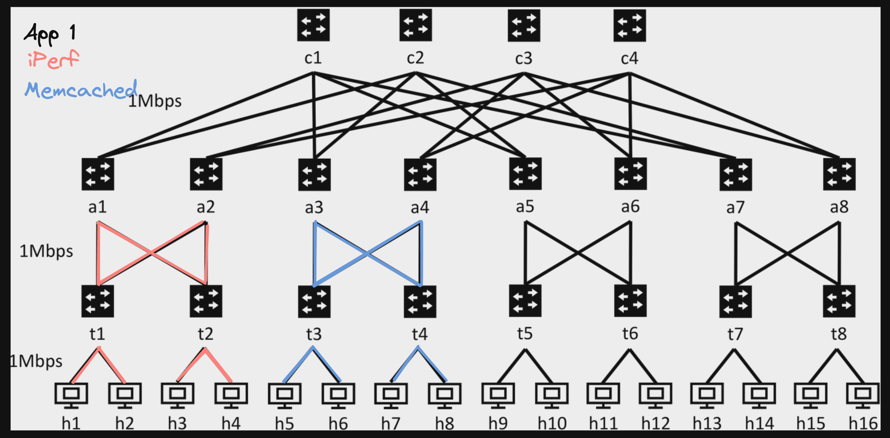
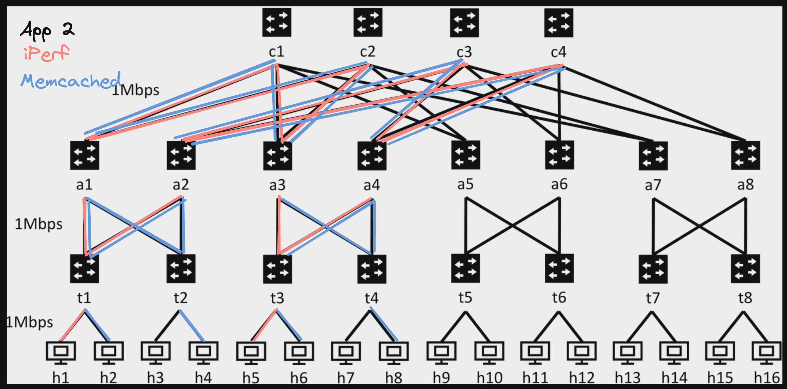

# CS 145 Project 3

## Author and collaborators

### Author name

Cory Zimmerman

### Collaborators

(List any other collaborators and describe help you got from other students in the class.)

## Report

**ECMP performance**

- The average throughput of iPerf was 914.784 kbps, and the average latency of Memcached was 149.892 microseconds. Both were across five trials using an adapted version of the experiment script from project 1.
- I recomputed results for expr 1-3 and 1-2. I remember from project 1 that the results were very mixed. It seemed that was a shared experience across the class. In my re-recorded results, there was a clear winning trajectory across Memcached latency, with 218.288 microseconds for binary tree, 195.272 microseconds for twocore fattree, and 149.892 microseconds for ECMP fattree. The throughput for iPerf was much more mixed. There, I got 928.856 kbps for binary tree, 916.132 kbps for twocore fattree, and 914.784 kbps for ecmp fattree.
- While the iPerf throughput decreased over time, I also noticed my laptop heating up as I progressed from testing binary tree to twocore fattree to finally ECMP fattree. I suspect machine fatigue had at least some impact. Additionally, computational complexity per packet might also have an effect. The pset1 switches use exact DMAC address matching, while the ECMP switches use LPM on IP addresses, at least for downward traffic. I assume LPM matching takes more computation than exact matching, and the same for the additional hashing step required by the ECMP switches on upward TOR and Aggregator flows.
- The Memcached results matched expectations. In the binary tree, there are congestion bottlenecks towards the top of the tree, slowing down packets, especially at the 2 mbps top link. The twocore fattree is better but not ideal. There, only half capacity is used between TORs, aggregators, and cores because TORs route to left aggregators, and the left aggregators only use the first two cores. The balanced ECMP fattree has less total congestion at the TOR, aggregator, and core levels because packets are efficiently balanced across all possible paths, utilizing the full capacity of the tree. This decreased congestion per link allows packets to flow through the network more quickly, which the faster Memcached results demonstrate.
- Screenshots of my times can be found in the `/benchmarks` directory, and results are summarized in this spreadsheet: https://docs.google.com/spreadsheets/d/11scK4CpdEkNz8B8TYIKE_YDTkZypKhualLtFWCEAiyI/edit?usp=sharing

**Bisection Bandwidth**

- The theoretical bisection bandwidth of the ECMP fattree with four-port switches is 8 mbps.
- After adding UDP support to the ECMP fattree, I observed bisection bandwidth throughput of 606.39 and 663.82 kbps for the first and second tests respectively.
- For the binary tree, I observed bisection bandwidth throughput of 242.41 and 242.39 kbps for the first and second tests respectively.
- Test results are on the second page of the spreadsheet linked above, and pics are again in the `/benchmarks` directory.
- For bisec1, the ECMP fattree displayed 363.98 kbps more bisection bandwidth than the binary tree. In the binary tree topology from project 1, the bisection bandwidth is limited by the 2 mbps link at the top switch labeled "a1". Because of this bottleneck, the theoretical bandwidth is 2 mbps, so I'd expect (theoretically) the ECMP fattree to have 4x the bandwidth of the binary tree. This generally plays out in the results. The ECMP fattree results indicate 2.5x to 2.75x the bandwidth of the binary tree. My experience has been that ECMP results are greatly sensitive to CPU capacity, so I'm guessing the difference would be even greater on a more powerful computer. For similar reasons, it makes sense that theory operates at mbps, while the emulator operates at kbps. In a simulation like this on a laptop, it's unlikely that each switch and link would operate at peak efficiency. Instead, I trust that the relative performance is consistent even if the observed values are much slower than the theoretical expectation. In this relative performance, the ECMP fattree is preferable over the binary tree because it isn't limited by bottlenecks high up in the tree and is able to utilize the full capacity of the network.

**Application Placement**

- First, as mentioned in Warren's Ed post, I began by merging the duplicate dict trace keys into a single list and then regenerating the trace. After doing that, I ran the apps. Again, the results are on the Google Sheet and pics are in `/benchmarks`. For app 1, I observed iPerf throughput of 899.39 kbps and Memcached latency of 1831.17 µs. For app 2, I observed iPerf throughput of 910.11 kbps and Memcached latency of 4185.77 µs. This huge difference in Memcached latency matches expectations. In the app 1 picture below, iPerf and Memcached are communicating within their own closed pods. That results in relatively few collisions. In contrast, iPerf and Memcached share paths in app 2, and traffic causes a big slowdown for Memcached due to congestion. This is visible in the overlapping pink and blue lines in the picture. There's not a serious difference in iPerf traffic between the two apps. I suspect faster Memcached traffic means more Memcached traffic, which might slow down iPerf flows a bit. However, my understanding is that iPerf fills the network, while Memcached sporadically sends small packets. So, Memcached is probably a lot more sensitive to traffic volume than iPerf, which generates most of the traffic anyway.

## Citations

https://p4.org/p4-spec/docs/P4-16-v1.0.0-spec.html

## Grading notes (if any)

My ECMP approach uses the python `random` library to fill the TOR and Aggregator hash/port mappings. I've never seen the ECMP test fail due to skewed randomness, but there is of-course a chance. If it fails while grading with results close to but not exactly within the range, can you please try again? It's always passed for me, but the randomness doesn't necessarily guarantee that.

I copied over `controller/ftree_topo.py` and `controller/routing.py` from project 1. They weren't new to this project, although I did make some modifications.

## Extra credit attempted (if any)
