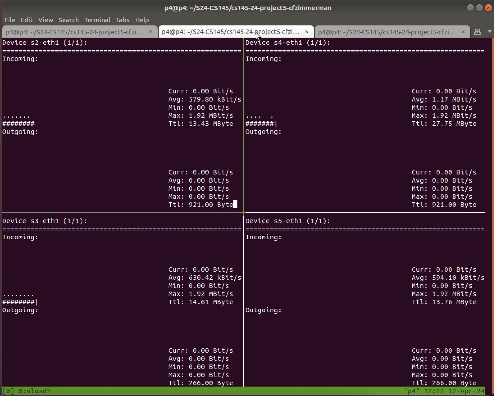
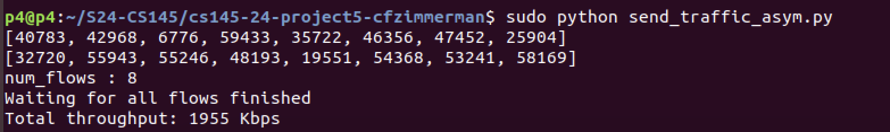
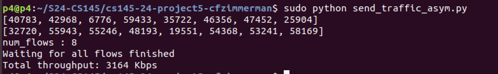
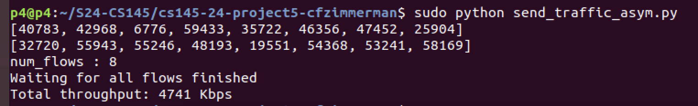

# CS 145 Project 5

## Author and collaborators

### Author name

Cory Zimmerman, cfzimmerman@college.harvard.edu

### Collaborators

I talked to Nathaniel Birne about q2, mostly about what we were even asked to do on the pcap part.

## Report

### Part 0

I ran the tests and got these results:

As expected, the flows didn't reach capacity. The best flow into s4 reached 1.17 mb/s, but the four incoming flows together averaged only 744 kb/s.

### Part 1
My implementation of flowlet switching generally follows the suggestions provided by the readme and section slides.

There are two arrays of bits treated as hash tables, one called `flow_to_timestamp` and another called `flow_to_hash_index`. Given a packet, I first hash the five tuple mod the size of the hash tables. That gives an index into `flow_to_timestamp` holding the last time this flow was accessed. If the last logged flow was recent (set by a constant), then the corresponding port number is read back from `flow_to_hash_index` and saved in the meta struct for later use.

Otherwise, the port needs to be refreshed. I generate a random number to be the new ID for this flowlet and hash a 6-tuple including the new `flowlet_id`, saving this result mod the number of ports in my switches to the meta struct. That's also saved to `flow_to_hash_index` for later use. With every packet, the most recent timestamp in `flow_to_timestamp` is also updated.

This solution ensures packets that hash to the same 5-tuple stay on the same path as long as packets are tightly packed. As soon as there's a time gap (currently 50 ms), the `flowlet_id` redirects the flowlet onto a different path. This pleases TCP by keeping packets mostly in order while still distributing flows across different paths when possible, leading to better network utilization.

### Part 2

_Note: I saved pictures for all data not linked in a CSV. Pics can be found at [report/pics](pics)._

**ECMP v. Flowlet**

For my implementation of ECMP from project 3, a test seed of `1` caused collisions. I ran my tests for 70 seconds each with a seed of `1`. Results are below:

ECMP:
- Flow 1
  - Sender: 511 kbits/sec
  - Receiver: 495 kbits/sec
  - Min bandwidth: 398 kb/sec
- Flow 2:
  - Sender: 511 kbits/sec
  - Receiver: 496 kbits/sec
  - Min bandwidth: 398 kb/sec

Running the same test with a seed of `1` for 70 seconds on my flowlet network yielded the following results:

Flowlet:
- Flow 1
  - Sender: 1.03 mb/sec
  - Receiver: 976 kb/sec
  - Min bandwidth: 958 kb/sec
- Flow 2
  - Sender: 1.02 mb/sec
  - Receiver: 990 kb/sec
  - Min bandwidth: 958 kb/sec

ECMP and flowlet network performance is relatively equal for most seeds, indicating a baseline optimal network performance of roughly 1 mb/sec. However, when ECMP flows are routed along the same path, collisions severly impact performance (numbers above are from a collision case). Because colliding flows have to fight over the same bandwidth, it makes sense that their performance is roughtly half what is otherwise expected.

In contrast, the flowlet network (at 50 ms timeout) is relatively unaffected by changes to the seed because it distributes packets evenly across available paths. Because this even flow can be fully absorbed by all the collective links in the network, flowlet switching matches ECMP without collisions and far outperforms it when ECMP flows collide.

**PCAP**

For pcap anaysis, I re-ran my network with the same seed for 30 seconds instead of 70 seconds. This helped decrease the total volume of pcap data to a more manageable size. Even with that, there were about 9,600 lines of logs to parse. I wrote a cli tool in [pcap_analysis](../pcap_analysis) to parse these logs. Given the path to a directory of Mininet log files, it iterates all files and extracts five-tuple data. When in five-tuple mode, it just stops there, outputting all five-tuples to the given csv path. Otherwise, during extraction, pcap data is stored in a min heap by timestamp and indexed by `(src ip, dst ip)` pairs. The parser also takes the flowlet timeout as an argument for this mode (ex 50 ms). Knowing the timeout, it processes each flow's heap, grouping all packets spaced within the timeout into a single flowlet. Once the time limit is exceeded, a flowlet is closed and added to the results (or a previous count is updated if it has been seen before). Over all flows and all flowlets, this generates a list of closely-associated switch IDs for each flow and a count of how often they appear. That data's written to an output CSV.

I git-tracked my pcap files and ran them through this tool. The output csvs are in the source code, but I cleaned then up and put them in Google Sheets as well. Please view these, as they're my submission for this question:

- Five-tuples: https://docs.google.com/spreadsheets/d/1rtu6R6MlCFczpUvoikwgiRwEYtn7Ysqt4EZkrkz7--s/edit?usp=sharing
- Paths: https://docs.google.com/spreadsheets/d/132N8gwqQl7-dyzRoXBzdTv2VvLqLV5lA6jb-yNi_xvU/edit?usp=drive_link

On the five-tuples sheet, the entries in green correspond to the ports printed by the test script. The majority of the five-tuples are funneled along the expected paths. I suspect the green packets that occurred 148 times might have been cumulative ACKs. The other ports are puzzling. I initially thought they might be from packet corruption, but their frequencies are too regular for that. Because this analysis considers all data in the pcap files, I presume those flows were generated from other sources.

From the raw paths csv, I sorted the data by frequency (called hits in the spreadsheet). The top 8 flows dominated the total amount of traffic, making up about 91 percent of recorded clusters. This makes sense, as my window-based heuristic left room for noisy results. Some of the lower-count entries have more or fewer than five entries, and I suspect those arose during flowlet transition periods.

Among the top 8, traffic appears evenly distributed across both flows and paths. The two pairs of hosts are colored purple and yellow. The cli tool sorted path members alphabetically, but I also re-ordered the switch appearances of the top 8 entries based on the network topology. The column labeled `Path (manually reordered)` is my submission for the specific paths each flowlet takes.

_Edit: I realized after finishing this project that issues with git tracking led to some old pcap files not being removed from the [pcap_snapshot](../pcap_snapshot) source directory. They're the cause of unrelated data in the five-tuples and paths results. I don't have time to re-generate and re-clean the results, but please just ignore data that seems totally extraneous. It snuck in from a different set of network events._

**Extra credit**

I tested timeout values in the range from 5 ms to 500 ms and plotted the results in Google Sheets:
https://docs.google.com/spreadsheets/d/13g8z9KNl7otGyD0vH5gMB_4UOQqTUJ0HKfJZ5zpgkAs/edit?usp=sharing

Because flow conflicts were not deterministic, I enforced a strategy of running the 10-second tests 8 times and choosing the one with the greatest cumulative packet loss. This effectively selected the worst-case scenario for all timeouts. The chart in the spreadsheet specifically tracks receiver bandwidth. I chose this over sender bandwidth, as it's a clearer indicator of how much data makes it through in-tact.

At high timeouts, flows hashed to the same paths and interrupted each other significantly. The behavior was similar to normal ECMP collisions. At lower timeouts, packets were much more balanced. However, as the timeout decreased, there were also more retries. This is consistent with the expectation that random packet spraying causes TCP to re-send more data. From these results, it seems a timeout in the range of 25 to 50 milliseconds is most advantageous on this network.

### Part 3

For this part, I created a separate topology file and controller for running flowlet switches on the asymmetric topology. The separate controller was needed to interface with flowlet tables. A separate topology file was helpful for debugging. The two tests run on the same structure of hosts and switches, but the flowlet topology has fewer explicit configurations (none should affect performance, though). Tests were run using the following commands:

- ECMP:
  - Start mininet: `sudo p4run --config topology/p4app-asym-ecmp.json`
  - Load controller: `python observe/routing-controller.python`
- Flowlet:
  - Start mininet: `sudo p4run --config topology/p4app-asym-flowlet.json`
  - Load controller: `python controller/controller_flowlet_asym.py`

Results were generated using `python send_traffic_asym.py`. In my tests, ECMP had a total throughput across 8 flows of 1955 kbps, and the flowlet network had total throughput across 8 flows of 3146 kbps. This indicates a clear win for the flowlet network over the ECMP network. I suspect ECMP flows were hashed disproportionately onto a single route, leading to extra congestion and lower throughput. In contrast, the flowlet network distributed load evenly across available paths. So, even while unaware of congestion, flowlet still managed to keep flows well-balanced across both paths from s1->s2->s4 and s1->s3->s4.

Because the code was provided, I also ran the CONGA network, which handled 4741 kbps of traffic. This makes sense, as the CONGA network is able to route more traffic over the top path than the bottom path, accounting for the tightened 2 mbps link on the bottom path.

Asymmetric ECMP:

Asymmetric Flowlet:

Asymmetric CONGA:

## Citations

My pcap parser relies on quite a few dependencies, which can be found in [pcap_analysis/Cargo.toml](../pcap_analysis/Cargo.toml).

## Grading notes (if any)

Feel free to run my code in `../pcap_analysis` if you'd like. It's written in Rust, so you'll need to have that installed on your system: https://www.rust-lang.org/tools/install. After installation, call `cargo run --release -- --help`. That will print a list of options in my cli tool. My source data is in [pcap_snapshot](../pcap_snapshot), and skipping the cli argument prints results to stdout.

Also, pretty much all results requested by the readme are in linked Google Sheets. Please visit the links, and let me know if you have any trouble accessing them. Thanks!

## Extra credit attempted (if any)

I did the extra credit at the end of question 2. There's an "Extra credit" heading above with my results.
